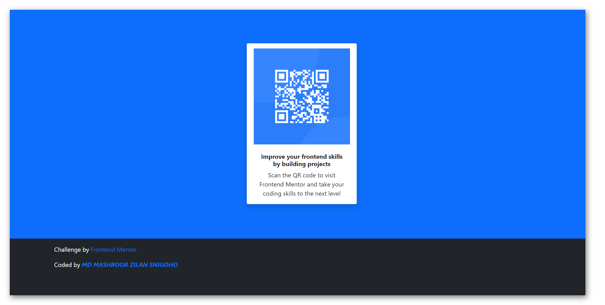

# Frontend Mentor - QR code component solution

This is a solution to the [QR code component challenge on Frontend Mentor](https://www.frontendmentor.io/challenges/qr-code-component-iux_sIO_H). Frontend Mentor challenges help you improve your coding skills by building realistic projects.

## Table of contents

- [Overview](#overview)
  - [Screenshot](#screenshot)
  - [Links](#links)
- [My process](#my-process)
  - [Built with](#built-with)
  - [What I learned](#what-i-learned)
  - [Continued development](#continued-development)
  - [Useful resources](#useful-resources)
- [Author](#author)
- [Acknowledgments](#acknowledgments)

## Overview

### Screenshot

### Links

- Solution URL: [https://github.com/mzs21/qr-code-component](https://github.com/mzs21/qr-code-component)
- Live Site URL: [https://mzs21.github.io/qr-code-component/](https://mzs21.github.io/qr-code-component/)

### Built with

- Semantic HTML5 markup
- [Bootstrap](https://getbootstrap.com/) - CSS framework

### What I learned

This is my first project using Bootstrap. Starting to get excel at Bootstrap.

### Continued development

Still learning about Bootstrap & how it works

### Useful resources

- [Bootstrap](https://getbootstrap.com/) - The documentation is of a great help.

## Author

- Website - [MD MASHROOR ZILAN SNIGDHO](https://github.com/mzs21)
- Frontend Mentor - [mzs21](https://www.frontendmentor.io/profile/mzs21)
- LinkedIn - [mdmzs](https://www.linkedin.com/in/mdmzs/)
- Twitter - [Snigdho21](https://twitter.com/Snigdho21)
